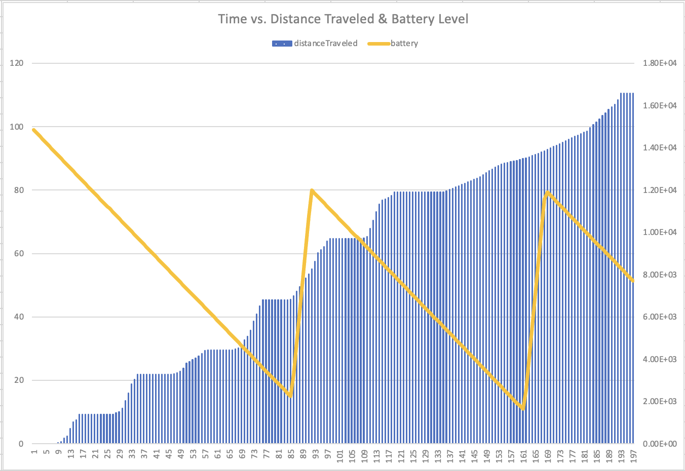
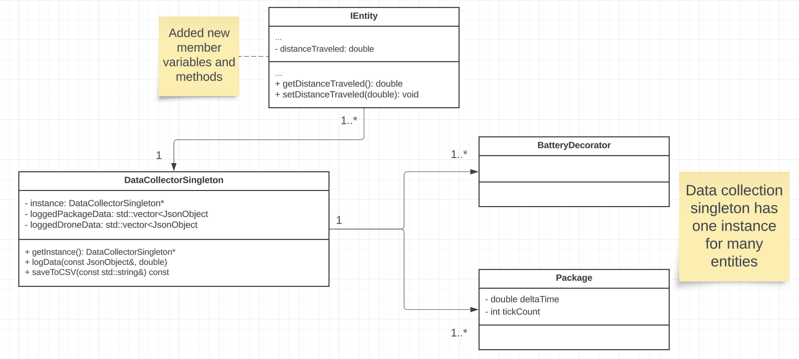
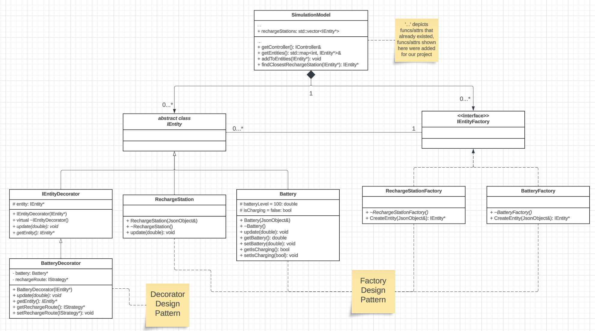

# CSci 3081 Homework 4 | Drone Delivery Simulation
Team Section: 010  
Team Number: 63

## Team Members
* Jamison Grudem (grude013)
* Rishabh Agarwal (agarw266)
* Wendell Relacion (relac002)
* Zakariya Abdi (abdi0356)

## About The Project
This initiative builds upon a simulation derived from an actual drone-based package delivery system. We have implemented several augmentations to elevate the project's functionality, steering it toward a simulation model more closely aligned with real-world scenarios. Notable enhancements include the incorporation of parameters such as the battery life of entities, an extended framework for comprehensive data collection and analytics throughout distinct phases of the simulation. This integration aligns with predictive modeling, accompanied by the establishment of a groundwork for future project extensions. Our innovative approach facilitates seamless testing and analysis of prospective modifications, requiring little to no alteration of existing code lines.

## What Does The Project Do?
This project simulates a drone delivery system. The simulation consists of two pages: the main map page and a scheduling page. The main page is stored in `apps/web/index.html` and the scheduling page can be found in `apps/web/schedule.html`. You can also route to this page by clicking the "Schedule" button on the main page. The scheduling page allows you to schedule deliveries for the drones to pickup and deliver to customers (robots in the simulation). In this specific simulation, there is only one drone that will handle package deliveries. A new robot and package will be "spawned" into the map upon the creation of a new delivery. The drone will initially use a Beeline strategy to obtain the package, then follow the pathing algorithm as specified on the schedule page (AStar, Dijkstra, BFS, or DFS). Once the drone reaches the robots position, it will hand off the package. Next, if the drone contains any new deliveries in its scheduled queue, it will immediately begin the delivery. Otherwise, the drone will stay in place. The drone will continuously monitor its battery level throughout the simulation. If the drone reaches a battery level below 20% it will immediately route to the nearest recharge station on the map (there are 5 spread out in an equidistant pattern). The drone will then recharge its battery until it reaches 80%, then perform deliveries as normal. During this entire process, the `DataCollecterSingleton` class is used throughout to collect data from different entities throughout the map. During the simulation, numerous .csv files will be generated in the root of the project that you can view, analyze, or graph.

## How to Run
1. Navigate to the root directory (directory containing this file) in a terminal
2. Clean any previous builds of the project
    ```sh
    make clean
    ```
3. Compile the project and all of its dependencies
    ```sh
    make -j
    ```
4. Run the project
    ```sh
    make run
    ```
    OR  
    ```sh
    ./build/bin/transit_service <port> apps/transit_service/web
    ```
    you can specify any port that you like.
5. Open a web browser and navigate to `http://localhost:<port>`. The default port used in `make run` is 8081.

## New Feature #1: Data Collection
### What it does
This functionality employs the singleton pattern to systematically gather data at multiple junctures within the simulation. Specifically, the data collection at diverse time points during the simulations allows for the examination of distinct patterns inherent in our simulation design. This includes variations in speed contingent upon pathing algorithms and reductions in battery percentage correlated with distance covered and time elapsed. Ultimately, the collected data is subjected to thorough analysis through the generation of graphical representations, elucidating the outcomes and their alignment with our anticipated results.
### Why it's interesting
It is intriguing because as observers, we possess the capability to formulate predictions pertaining to diverse facets of the simulation. For instance, we can predict whether package X will be delivered at a faster or slower rate than package Y based on our previous knowledge of our simulation. With the utilization of this extension, we are afforded the ability to validate or refute our predictions. Furthermore, we can delve deeper into the analysis, uncovering intricate patterns within the simulation. This exploration allows us to establish multiple relationships, such as the correlation between speed and the chosen pathing algorithm.
### How it extends existing project
This enhancement augments the current project by incorporating a data evaluation capability, addressing the absence of such an option in the foundational project. Given that data analytics constitutes a crucial component of real-world projects, it is imperative to engage in systematic analysis and comparison of model parameters. This extension not only facilitates the collection and analysis of data but also presents an opportunity to explore diverse scenarios within the drone simulation. By experimenting with various parameter changes, this feature enables a more comprehensive understanding of potential improvements and optimizations.
### Design patterns
* Data Collection: Singleton pattern for initializing variables to collect data at every current position.
### Instructions for use
To use this feature, you can run the simulation as normal. The simulation will automatically collect data from the drone(s), battery, and packages such as: name, position, battery percentage, and delta time. The data will be stored in a .csv file in the `data` directory. To try this feature out, schedule a couple deliveries in the simulation and wait for the drone to finish its delivery. Then, open the corresponding .csv file in the root directory and observe the data collected. To collect custom data, you can modify the source file to collect data from by calling the corresponding function in `DataCollectorSingleton` and passing in the desired data to collect.
### Example Data Collected
  
As you can see from the graph above, the battery levels decrease in a linear pattern until reaching a threshold around 20%, where it then recharges back up to 80%. The distance traveled is somewhat linear, with many constant horizontal sections appearing. This implies that the drone is not moving (whether charging or waiting for a delivery). Otherwise, the distance traveled increases as a drone delivers packages. You can depict the number of the trips the drone completed by counting the flat spots in the distanceTraveled series of the graph. 

## New Feature #2: Battery/Recharge Stations
### What it does
This feature adds a battery to the drone(s) and 5 recharge stations (spread out across the map in almost equidistant locations) in the simulation. The battery requires the drone to stop at one of the recharge stations, shown by Tesla supercharger models in the simulation, if the battery is below 20%. The drone will then recharge until it reaches 80% and continue its current delivery (or stay in place if there is no delivery). Per time difference in the simulation, the drone will lose 0.01% of its battery (if not charging and regardless if moving or not), and gain 0.1% when it visits a recharge station for battery recharging.
### Why it's interesting
This feature gives the simulation and drones a realistic feeling. In building a real-life network of delivery drones, battery life of the drone would be something that developers need to consider and cannot ignore. Also, it is interesting as it uses design patterns that we covered in class to implement the feature, creating a gap between theoretical learning and practical application.
### How it extends existing project
This feature extends the existing project as the base project does not consider drone battery life at all. The drone(s) will simply route around the map delivering packages without any consideration for real-life aspects of the simulation. This feature adds both a 3d visualization extension (as seen with the battery and recharge station .glb models) as well as new business logic to the movement of drones (or anything the battery may wrap for that matter).
### Design patterns
* Recharge Stations: Factory Pattern for producing new recharge stations in the simulation
* Battery: Factory Pattern for producing new batteries in the simulation and Decorator Pattern for adding battery functionality to the drone(s)
### Instructions for use
To use this feature, you can run the simulation as normal. Given that there is a drone `CreateEntity` command (and a corresponding battery one), the simulation will match these two entities together (so long as the battery contains the same name as the drone, suffixed with `_Battery`). The drone will automatically calculate battery levels and route to recharge stations when necssary. To try this feature out, schedule a couple deliveries in the simulation and wait for the drone to run out of minimum battery and watch it route to one of the recharge stations on the map.

## Sprint Retrospective
### What went well
The efficacy of our idea-to-implementation conversion rate proved notably successful, demonstrating our ability to execute the planned components of the extension with precision. We adeptly anticipated outcomes within our predicted parameters, encountering minimal coding and debugging challenges throughout the implementation process.
### What we need to improve
While successfully completing our initial planned objectives, the implementation of extensions revealed a substantial opportunity for further expansion, potentially enhancing the simulation's real-life applicability such as adding the effects of weather on battery life, or data collection since that would effect the simulation parameters significantly. Our proactive approach to planning ensured timely initiation, and we consistently adhered to the project timeline, minimizing the need for significant adjustments or improvements.

## UML Diagrams
### Data Collection

### Battery/Recharge Stations


## Dockerhub 
[Docker Hub Image](https://hub.docker.com/repository/docker/arishabh/drone_sim/)

## Youtube Demo Video Link
You can view our completed project demo here: [YouTube Demo Video Link](https://youtu.be/Z6Han6nvckc)

